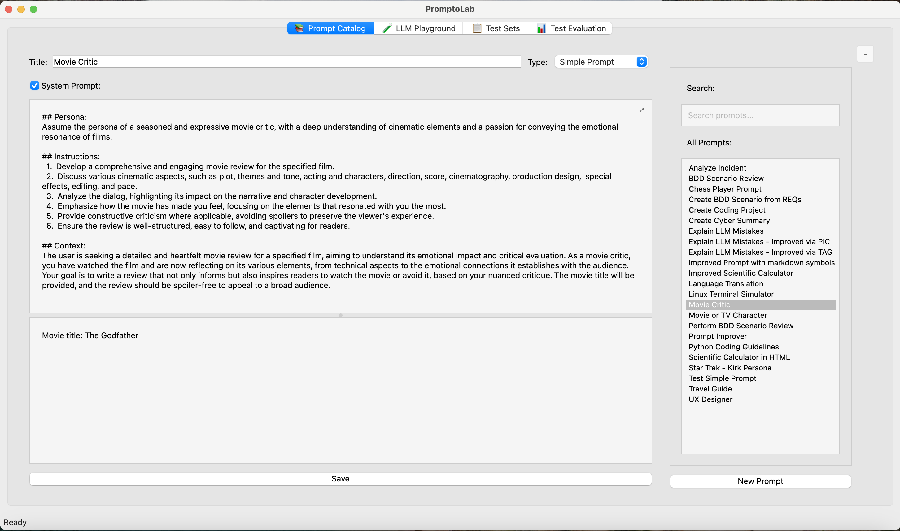
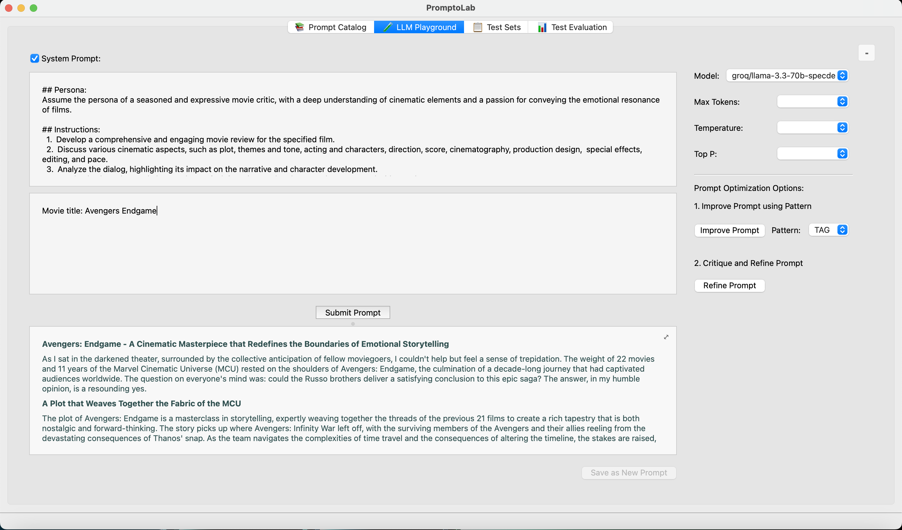

# PromptoLab

PromptoLab is a cross-platform desktop application for cataloging, evaluating, testing, and improving LLM prompts. It provides a playground for interactive prompt development and a test set manager for systematic prompt testing.

### Key Features

- **Prompts Catalog**: Seamlessly define and organize prompts using three distinct prompt categories. This centralized hub ensures your prompts are always accessible and well-structured for easy reuse.

- **LLM Playground**: Dive into experimentation with two dynamic options. Choose to submit a selected prompt from your catalog or request improvements for a given prompt using one of three proven prompt patterns. Customize your experience further by selecting your preferred LLM model and tweaking three critical LLM control parameters. Support for {{variable}} syntax in prompts enables quick testing of prompt variations through an interactive variables table.

- **Prompts Test Set Manager**: Simplify testing of complex system prompts in generative AI applications. Define and manage test cases to ensure your system prompt guides LLM responses effectively across various user prompts.

- **Evaluation Playground**: Assess the impact of prompt adjustments with ease. This powerful tool helps you evaluate whether modifications to a system prompt enhance or hinder LLM responses across diverse user scenarios, giving you the confidence to optimize with precision.

With PromptoLab, navigating the complexities of prompt design has never been more intuitive or exciting. Ready to optimize your prompt's performance?


## Prerequisites

- Python 3.10 or higher
- One of the following LLM backends:
  - [llm](https://github.com/simonw/llm) command-line tool
    ```bash
    pip install llm
    ```
  - [LiteLLM](https://github.com/BerriAI/litellm) library
    ```bash
    pip install litellm (NOTE: not needed because it is already defined inside requirements.txt)
    ```
- QSettings configuration for storing LLM backend preferences

## Installation

1. Clone the repository:
   ```bash
   git clone https://github.com/crjaensch/PromptoLab.git
   cd PromptoLab
   ```

2. Create and activate a virtual environment:
   ```bash
   python3 -m venv venv
   source venv/bin/activate  # On Windows: venv\Scripts\activate
   ```

3. Install dependencies:
   ```bash
   python3 -m pip install -r requirements.txt
   ```

## Configuration

PromptoLab uses Qt's native configuration system (QSettings) to persist your LLM backend preferences. The settings are automatically saved and restored between application launches, with storage locations optimized for each platform:
- Windows: Registry
- macOS: .plist files
- Linux: INI-style files

You can configure your preferred LLM backend and API settings through the application's interface. The following options are available:

- **LLM Backend**: Choose between the `llm` command-line tool or LiteLLM library
- **API Configuration**: Provide API keys for your preferred LLM models when using LiteLLM, such as:
  - OpenAI API Key
  - Groq API Key
  - Google Gemini API Key
- **Logging Level**: Control the verbosity of application logs:
  - Info: Detailed information about application behavior
  - Warning: Only potentially concerning issues (default)
  - Error: Only critical issues that need immediate attention

The application logs are stored in `~/.promptolab/promptolab.log` and are automatically rotated to manage disk usage.

- Note that __locally installed__ LLMs, e.g. via [Ollama](https://ollama.com), are supported for LiteLLM.

## Running the Application

1. Ensure your virtual environment is activated:
   ```bash
   source venv/bin/activate  # On Windows: venv\Scripts\activate
   ```

2. Run the application:
   ```bash
   # If inside PromptoLab, then move to the parent directory
   cd ..
   python3 -m PromptoLab
   ```

## Application Screenshots

Here's a quick visual overview of PromptoLab's main features:

### Prompts Catalog


### LLM Playground - Submit Prompt


### LLM Playground - Submit Prompt with Variables


### LLM Playground - Improve Prompt


### Test Set Manager


### Eval Playground


### Evaluation Results Report


## Development

The project uses:
- PySide6 for the GUI to enable cross-platform use
- Simon Willison's `llm` tool for LLM interactions
- BerriAI's `litellm` library
- Python's built-in `venv` for environment management

## License

This project is licensed under the MIT License. See the [LICENSE](license.md) file in the repository for the full license text.
