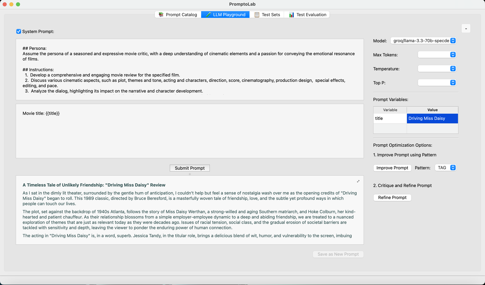
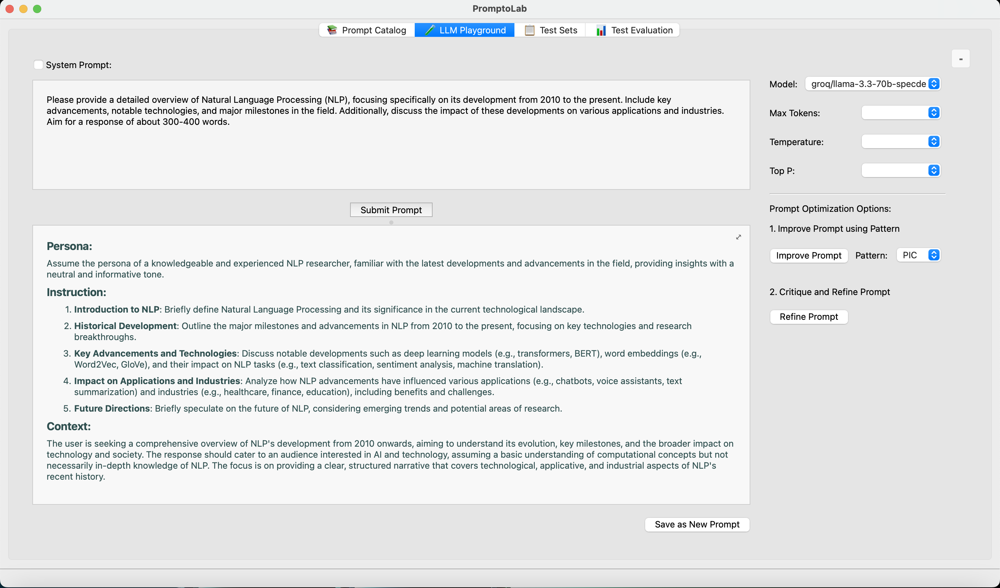
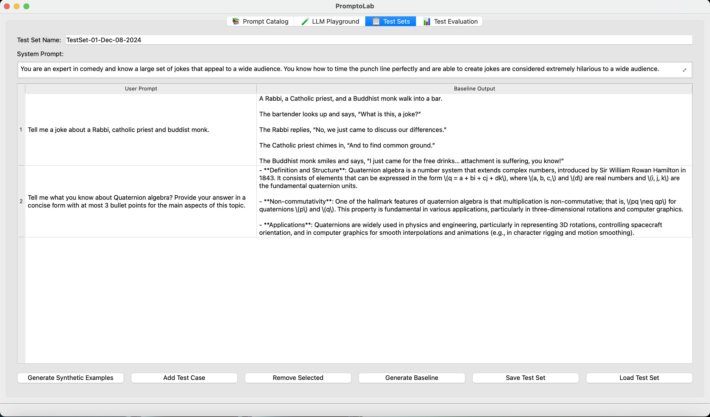
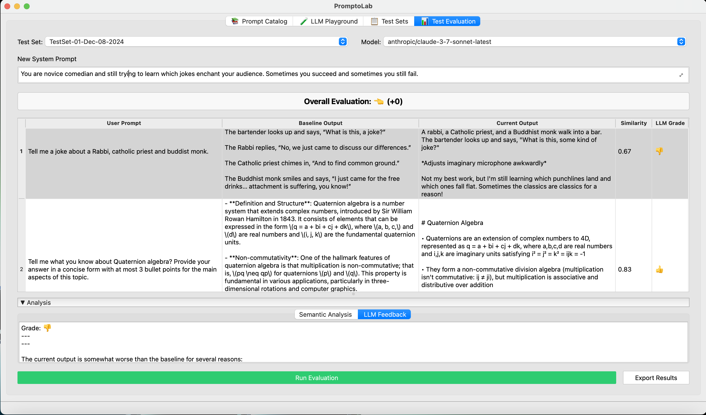

# PromptoLab

PromptoLab is a cross-platform desktop application for cataloging, evaluating, testing, and improving LLM prompts. It provides a playground for interactive prompt development and a test set manager for systematic prompt testing.

### Key Features

- **Prompts Catalog**: Seamlessly define and organize prompts using three distinct prompt categories. This centralized hub ensures your prompts are always accessible and well-structured for easy reuse.

- **LLM Playground**: Dive into experimentation with multiple optimization options. Choose to submit a selected prompt from your catalog or optimize your prompts using two powerful methods:
  - **Improve Prompt with Pattern**: Enhance your prompt using one of three proven prompt patterns (TAG, PIC, LIFE)
  - **Critique and Refine**: Iteratively optimize your prompt through an AI-powered critique and refinement process that analyzes strengths and weaknesses, suggests improvements, and implements them automatically
  
  Customize your experience further by selecting your preferred LLM model and tweaking critical LLM control parameters. Support for {{variable}} syntax in prompts enables quick testing of prompt variations through an interactive variables table.

- **Prompts Test Set Manager**: Simplify testing of complex system prompts in generative AI applications. Define and manage test cases to ensure your system prompt guides LLM responses effectively across various user prompts. Includes a new synthetic example generator that automatically creates diverse test cases using LLMs.

- **Evaluation Playground**: Assess the impact of prompt adjustments with ease. This powerful tool helps you evaluate whether modifications to a system prompt enhance or hinder LLM responses across diverse user scenarios. The intuitive comparative grading system uses thumb emojis to clearly indicate performance relative to baseline:
  - 👎👎 : Significantly worse than baseline
  - 👎 : Somewhat worse than baseline
  - 👈 : About the same as baseline
  - 👍 : Somewhat better than baseline
  - 👍👍 : Significantly better than baseline

With PromptoLab, navigating the complexities of prompt design has never been more intuitive or exciting. Ready to optimize your prompt's performance?


## Prerequisites

- Python 3.10 or higher
- One of the following LLM backends:
  - [llm](https://github.com/simonw/llm) command-line tool
    ```bash
    pip install llm
    ```
  - [LiteLLM](https://github.com/BerriAI/litellm) library
    ```bash
    pip install litellm (NOTE: not needed because it is already defined inside requirements.txt)
    ```
- QSettings configuration for storing LLM backend preferences

## Installation

1. Clone the repository:
   ```bash
   git clone https://github.com/crjaensch/PromptoLab.git
   cd PromptoLab
   ```

2. Create and activate a virtual environment:
   ```bash
   python3 -m venv venv
   source venv/bin/activate  # On Windows: venv\Scripts\activate
   ```

3. Install dependencies:
   ```bash
   python3 -m pip install -r requirements.txt
   ```

## Configuration

PromptoLab uses Qt's native configuration system (QSettings) to persist your LLM backend preferences. The settings are automatically saved and restored between application launches, with storage locations optimized for each platform:
- Windows: Registry
- macOS: .plist files
- Linux: INI-style files

You can configure your preferred LLM backend and API settings through the application's interface. The following options are available:

- **LLM Backend**: Choose between the `llm` command-line tool or LiteLLM library
- **API Configuration**: Provide API keys for your preferred LLM models when using LiteLLM, such as:
  - OpenAI API Key
  - Groq API Key
  - Google Gemini API Key
- **Logging Level**: Control the verbosity of application logs:
  - Info: Detailed information about application behavior
  - Warning: Only potentially concerning issues (default)
  - Error: Only critical issues that need immediate attention

The application logs are stored in `~/.promptolab/promptolab.log` and are automatically rotated to manage disk usage.

- Note that __locally installed__ LLMs, e.g. via [Ollama](https://ollama.com), are supported for LiteLLM.

## Running the Application

1. Ensure your virtual environment is activated:
   ```bash
   source venv/bin/activate  # On Windows: venv\Scripts\activate
   ```

2. Run the application:
   ```bash
   # Run from within the PromptoLab directory
   python3 -m src
   ```

## Application Screenshots

Here's a quick visual overview of PromptoLab's main features:

### Prompts Catalog


### LLM Playground - Submit Prompt


### LLM Playground - Submit Prompt with Variables


### LLM Playground - Improve Prompt


### LLM Playground - Critique and Refine
The Critique and Refine method is a powerful new feature that iteratively improves your prompts through AI-powered analysis and refinement. This approach helps you create more effective prompts by:

1. **Analyzing** the current prompt for strengths and weaknesses
2. **Generating** specific suggestions for improvement
3. **Creating** a refined version that addresses the identified issues

You can configure the number of refinement iterations (1-5) to control how thoroughly the prompt is optimized. More iterations generally produce better results but take longer to process. This feature is particularly useful for complex prompts that need careful tuning to achieve optimal performance.

### Test Set Manager


### Synthetic Example Generator
The Synthetic Example Generator is a powerful new feature that helps you automatically create diverse test cases for your prompts using LLM models. This tool saves you time and effort by generating high-quality examples based on your task description.

**Key capabilities:**
- Generate multiple test cases in one click based on your task description
- Customize the number of examples to generate (1-20)
- Adjust diversity level to control how varied the examples should be
- Set complexity level to determine how challenging the examples should be
- Select from multiple LLM models to power the generation process
- Seamlessly add generated examples to your test sets

Access this feature directly from the Test Set Manager by clicking the "Generate Synthetic Examples" button. The generated examples include both user inputs and expected outputs, ready to be used in your prompt testing workflow.

### Eval Playground


### Evaluation Results Report


## Development

The project uses:
- PySide6 for the GUI to enable cross-platform use
- Simon Willison's `llm` tool for LLM interactions
- BerriAI's `litellm` library
- Python's built-in `venv` for environment management

## License

This project is licensed under the MIT License. See the [LICENSE](license.md) file in the repository for the full license text.
